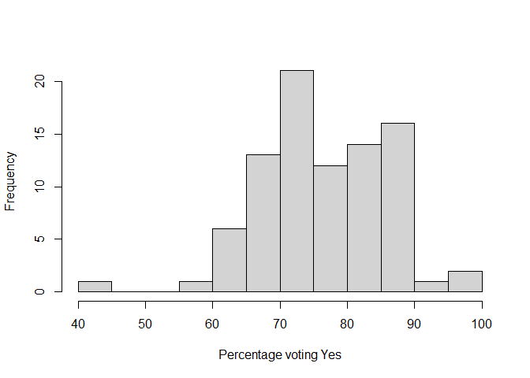
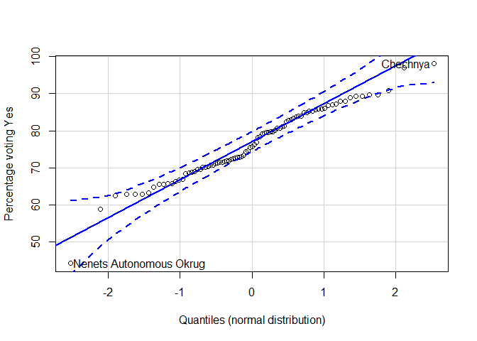
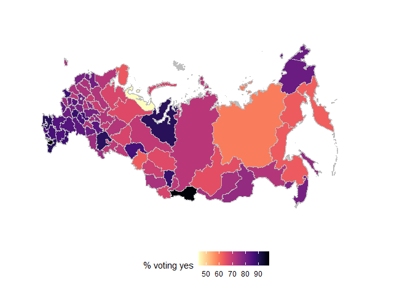

2020 Russian constitutional referendum
================
Andi (<almost@gmail.com>,
@[inductivestep](https://twitter.com/InductiveStep))
05 July 2020

Using `rvest` to parse the 2020 Russian constitutional referendum
results from Wikipedia and do some sums. (To be continued…)

### Load packages

``` r
library(rvest)
library(car)
library(tidyverse)
library(kableExtra)
```

### Read in the data

``` r
wp_page <- read_html("https://en.wikipedia.org/wiki/2020_Russian_constitutional_referendum")
```

### Grab the table

``` r
results <- wp_page %>%
  html_node(xpath = '//*[@id="mw-content-text"]/div/table[10]') %>%
  html_table(fill = TRUE)
names(results) <- c("Region", "Votes_Yes", "Perc_Yes", "Votes_No", "Perc_No")
```

``` r
View(results)
```

### Cleaning

Remove an empty row and other stuff…

``` r
res_clean <- results %>%
  subset(!Region %in% c("",
                        "Source: CEC",
                        "Region"))
```

Remove the thousand separator commas.

``` r
res_clean %>%
  mutate_at(vars(starts_with("Votes")),
            ~ gsub(",", "", .)) -> res_clean
```

Now transform all the numbers to numerics.

``` r
res_clean %>%
  mutate_at(vars(!matches("Region")),
            as.numeric) -> res_clean
```

Remove those percentages:

``` r
res_clean %>%
  dplyr::select(-c(starts_with("Perc"))) -> res_clean
```

Have a peek:

``` r
View(res_clean)
```

### ’rithmetic

Total sums:

``` r
Total_Yes <- sum(res_clean$Votes_Yes)
Total_No  <- sum(res_clean$Votes_No)
```

Percentage voting for the changes.

``` r
Perc_Yes <- 100*Total_Yes / (Total_Yes + Total_No)
Perc_Yes
```

    ## [1] 78.55816

Compute the percentages again (more dp)

``` r
res_clean <- res_clean %>%
  mutate(Perc_Yes = 100*Votes_Yes / (Votes_Yes + Votes_No))
```

### Results

``` r
res_clean %>%
  arrange(Perc_Yes) %>%
  kable(align="lrrr", digits = 1)
```

<table>

<thead>

<tr>

<th style="text-align:left;">

Region

</th>

<th style="text-align:right;">

Votes\_Yes

</th>

<th style="text-align:right;">

Votes\_No

</th>

<th style="text-align:right;">

Perc\_Yes

</th>

</tr>

</thead>

<tbody>

<tr>

<td style="text-align:left;">

Nenets Autonomous Okrug

</td>

<td style="text-align:right;">

9567

</td>

<td style="text-align:right;">

12074

</td>

<td style="text-align:right;">

44.2

</td>

</tr>

<tr>

<td style="text-align:left;">

Yakutia

</td>

<td style="text-align:right;">

204435

</td>

<td style="text-align:right;">

142464

</td>

<td style="text-align:right;">

58.9

</td>

</tr>

<tr>

<td style="text-align:left;">

Kamchatka Krai

</td>

<td style="text-align:right;">

65485

</td>

<td style="text-align:right;">

39406

</td>

<td style="text-align:right;">

62.4

</td>

</tr>

<tr>

<td style="text-align:left;">

Omsk Oblast

</td>

<td style="text-align:right;">

610278

</td>

<td style="text-align:right;">

360348

</td>

<td style="text-align:right;">

62.9

</td>

</tr>

<tr>

<td style="text-align:left;">

Magadan Oblast

</td>

<td style="text-align:right;">

34035

</td>

<td style="text-align:right;">

20090

</td>

<td style="text-align:right;">

62.9

</td>

</tr>

<tr>

<td style="text-align:left;">

Khabarovsk Krai

</td>

<td style="text-align:right;">

271421

</td>

<td style="text-align:right;">

159662

</td>

<td style="text-align:right;">

63.0

</td>

</tr>

<tr>

<td style="text-align:left;">

Murmansk Oblast

</td>

<td style="text-align:right;">

163735

</td>

<td style="text-align:right;">

95095

</td>

<td style="text-align:right;">

63.3

</td>

</tr>

<tr>

<td style="text-align:left;">

Irkutsk Oblast

</td>

<td style="text-align:right;">

529770

</td>

<td style="text-align:right;">

287131

</td>

<td style="text-align:right;">

64.9

</td>

</tr>

<tr>

<td style="text-align:left;">

Tomsk Oblast

</td>

<td style="text-align:right;">

223046

</td>

<td style="text-align:right;">

117232

</td>

<td style="text-align:right;">

65.5

</td>

</tr>

<tr>

<td style="text-align:left;">

Baikonur

</td>

<td style="text-align:right;">

4288

</td>

<td style="text-align:right;">

2248

</td>

<td style="text-align:right;">

65.6

</td>

</tr>

<tr>

<td style="text-align:left;">

Komi Republic

</td>

<td style="text-align:right;">

221113

</td>

<td style="text-align:right;">

115322

</td>

<td style="text-align:right;">

65.7

</td>

</tr>

<tr>

<td style="text-align:left;">

Moscow

</td>

<td style="text-align:right;">

2855547

</td>

<td style="text-align:right;">

1485963

</td>

<td style="text-align:right;">

65.8

</td>

</tr>

<tr>

<td style="text-align:left;">

Arkhangelsk Oblast

</td>

<td style="text-align:right;">

297432

</td>

<td style="text-align:right;">

150935

</td>

<td style="text-align:right;">

66.3

</td>

</tr>

<tr>

<td style="text-align:left;">

Sverdlovsk Oblast

</td>

<td style="text-align:right;">

1132182

</td>

<td style="text-align:right;">

565242

</td>

<td style="text-align:right;">

66.7

</td>

</tr>

<tr>

<td style="text-align:left;">

Altai Republic

</td>

<td style="text-align:right;">

55291

</td>

<td style="text-align:right;">

27433

</td>

<td style="text-align:right;">

66.8

</td>

</tr>

<tr>

<td style="text-align:left;">

Novosibirsk Oblast

</td>

<td style="text-align:right;">

698857

</td>

<td style="text-align:right;">

323674

</td>

<td style="text-align:right;">

68.3

</td>

</tr>

<tr>

<td style="text-align:left;">

Kostroma Oblast

</td>

<td style="text-align:right;">

180846

</td>

<td style="text-align:right;">

83044

</td>

<td style="text-align:right;">

68.5

</td>

</tr>

<tr>

<td style="text-align:left;">

Yaroslavl Oblast

</td>

<td style="text-align:right;">

374053

</td>

<td style="text-align:right;">

168930

</td>

<td style="text-align:right;">

68.9

</td>

</tr>

<tr>

<td style="text-align:left;">

Russians abroad

</td>

<td style="text-align:right;">

99852

</td>

<td style="text-align:right;">

44939

</td>

<td style="text-align:right;">

69.0

</td>

</tr>

<tr>

<td style="text-align:left;">

Udmurtia

</td>

<td style="text-align:right;">

455908

</td>

<td style="text-align:right;">

199121

</td>

<td style="text-align:right;">

69.6

</td>

</tr>

<tr>

<td style="text-align:left;">

Khanty-Mansi Autonomous Okrug

</td>

<td style="text-align:right;">

487750

</td>

<td style="text-align:right;">

212434

</td>

<td style="text-align:right;">

69.7

</td>

</tr>

<tr>

<td style="text-align:left;">

Chelyabinsk Oblast

</td>

<td style="text-align:right;">

1190097

</td>

<td style="text-align:right;">

505597

</td>

<td style="text-align:right;">

70.2

</td>

</tr>

<tr>

<td style="text-align:left;">

Kurgan Oblast

</td>

<td style="text-align:right;">

276378

</td>

<td style="text-align:right;">

117294

</td>

<td style="text-align:right;">

70.2

</td>

</tr>

<tr>

<td style="text-align:left;">

Khakassia

</td>

<td style="text-align:right;">

141381

</td>

<td style="text-align:right;">

59758

</td>

<td style="text-align:right;">

70.3

</td>

</tr>

<tr>

<td style="text-align:left;">

Kaluga Oblast

</td>

<td style="text-align:right;">

338748

</td>

<td style="text-align:right;">

140003

</td>

<td style="text-align:right;">

70.8

</td>

</tr>

<tr>

<td style="text-align:left;">

Krasnoyarsk Krai

</td>

<td style="text-align:right;">

848638

</td>

<td style="text-align:right;">

350687

</td>

<td style="text-align:right;">

70.8

</td>

</tr>

<tr>

<td style="text-align:left;">

Republic of Karelia

</td>

<td style="text-align:right;">

168389

</td>

<td style="text-align:right;">

68304

</td>

<td style="text-align:right;">

71.1

</td>

</tr>

<tr>

<td style="text-align:left;">

Amur Oblast

</td>

<td style="text-align:right;">

258548

</td>

<td style="text-align:right;">

103726

</td>

<td style="text-align:right;">

71.4

</td>

</tr>

<tr>

<td style="text-align:left;">

Perm Krai

</td>

<td style="text-align:right;">

734802

</td>

<td style="text-align:right;">

293643

</td>

<td style="text-align:right;">

71.4

</td>

</tr>

<tr>

<td style="text-align:left;">

Kirov Oblast

</td>

<td style="text-align:right;">

409702

</td>

<td style="text-align:right;">

163247

</td>

<td style="text-align:right;">

71.5

</td>

</tr>

<tr>

<td style="text-align:left;">

Vologda Oblast

</td>

<td style="text-align:right;">

388615

</td>

<td style="text-align:right;">

152983

</td>

<td style="text-align:right;">

71.8

</td>

</tr>

<tr>

<td style="text-align:left;">

Ulyanovsk Oblast

</td>

<td style="text-align:right;">

379056

</td>

<td style="text-align:right;">

148346

</td>

<td style="text-align:right;">

71.9

</td>

</tr>

<tr>

<td style="text-align:left;">

Vladimir Oblast

</td>

<td style="text-align:right;">

419606

</td>

<td style="text-align:right;">

164025

</td>

<td style="text-align:right;">

71.9

</td>

</tr>

<tr>

<td style="text-align:left;">

Novgorod Oblast

</td>

<td style="text-align:right;">

172997

</td>

<td style="text-align:right;">

66616

</td>

<td style="text-align:right;">

72.2

</td>

</tr>

<tr>

<td style="text-align:left;">

Tver Oblast

</td>

<td style="text-align:right;">

410421

</td>

<td style="text-align:right;">

155409

</td>

<td style="text-align:right;">

72.5

</td>

</tr>

<tr>

<td style="text-align:left;">

Smolensk Oblast

</td>

<td style="text-align:right;">

296792

</td>

<td style="text-align:right;">

111247

</td>

<td style="text-align:right;">

72.7

</td>

</tr>

<tr>

<td style="text-align:left;">

Kaliningrad Oblast

</td>

<td style="text-align:right;">

334755

</td>

<td style="text-align:right;">

125341

</td>

<td style="text-align:right;">

72.8

</td>

</tr>

<tr>

<td style="text-align:left;">

Altai Krai

</td>

<td style="text-align:right;">

645603

</td>

<td style="text-align:right;">

241132

</td>

<td style="text-align:right;">

72.8

</td>

</tr>

<tr>

<td style="text-align:left;">

Buryatia

</td>

<td style="text-align:right;">

329208

</td>

<td style="text-align:right;">

121205

</td>

<td style="text-align:right;">

73.1

</td>

</tr>

<tr>

<td style="text-align:left;">

Chuvashia

</td>

<td style="text-align:right;">

426779

</td>

<td style="text-align:right;">

154351

</td>

<td style="text-align:right;">

73.4

</td>

</tr>

<tr>

<td style="text-align:left;">

Orenburg Oblast

</td>

<td style="text-align:right;">

834406

</td>

<td style="text-align:right;">

286720

</td>

<td style="text-align:right;">

74.4

</td>

</tr>

<tr>

<td style="text-align:left;">

Kursk Oblast

</td>

<td style="text-align:right;">

389300

</td>

<td style="text-align:right;">

133471

</td>

<td style="text-align:right;">

74.5

</td>

</tr>

<tr>

<td style="text-align:left;">

Zabaykalsky Krai

</td>

<td style="text-align:right;">

352670

</td>

<td style="text-align:right;">

114010

</td>

<td style="text-align:right;">

75.6

</td>

</tr>

<tr>

<td style="text-align:left;">

Sakhalin Oblast

</td>

<td style="text-align:right;">

189466

</td>

<td style="text-align:right;">

60853

</td>

<td style="text-align:right;">

75.7

</td>

</tr>

<tr>

<td style="text-align:left;">

Mari El

</td>

<td style="text-align:right;">

251831

</td>

<td style="text-align:right;">

77884

</td>

<td style="text-align:right;">

76.4

</td>

</tr>

<tr>

<td style="text-align:left;">

Ivanovo Oblast

</td>

<td style="text-align:right;">

390256

</td>

<td style="text-align:right;">

117846

</td>

<td style="text-align:right;">

76.8

</td>

</tr>

<tr>

<td style="text-align:left;">

Saint Petersburg

</td>

<td style="text-align:right;">

2241963

</td>

<td style="text-align:right;">

624517

</td>

<td style="text-align:right;">

78.2

</td>

</tr>

<tr>

<td style="text-align:left;">

Jewish Autonomous Oblast

</td>

<td style="text-align:right;">

70213

</td>

<td style="text-align:right;">

19430

</td>

<td style="text-align:right;">

78.3

</td>

</tr>

<tr>

<td style="text-align:left;">

Pskov Oblast

</td>

<td style="text-align:right;">

231684

</td>

<td style="text-align:right;">

60626

</td>

<td style="text-align:right;">

79.3

</td>

</tr>

<tr>

<td style="text-align:left;">

Lipetsk Oblast

</td>

<td style="text-align:right;">

479670

</td>

<td style="text-align:right;">

124509

</td>

<td style="text-align:right;">

79.4

</td>

</tr>

<tr>

<td style="text-align:left;">

Ryazan Oblast

</td>

<td style="text-align:right;">

499716

</td>

<td style="text-align:right;">

129104

</td>

<td style="text-align:right;">

79.5

</td>

</tr>

<tr>

<td style="text-align:left;">

Primorsky Krai

</td>

<td style="text-align:right;">

723089

</td>

<td style="text-align:right;">

185629

</td>

<td style="text-align:right;">

79.6

</td>

</tr>

<tr>

<td style="text-align:left;">

Moscow Oblast

</td>

<td style="text-align:right;">

3488197

</td>

<td style="text-align:right;">

888794

</td>

<td style="text-align:right;">

79.7

</td>

</tr>

<tr>

<td style="text-align:left;">

Nizhny Novgorod Oblast

</td>

<td style="text-align:right;">

1505620

</td>

<td style="text-align:right;">

382801

</td>

<td style="text-align:right;">

79.7

</td>

</tr>

<tr>

<td style="text-align:left;">

Leningrad Oblast

</td>

<td style="text-align:right;">

817168

</td>

<td style="text-align:right;">

203833

</td>

<td style="text-align:right;">

80.0

</td>

</tr>

<tr>

<td style="text-align:left;">

Voronezh Oblast

</td>

<td style="text-align:right;">

1070045

</td>

<td style="text-align:right;">

256306

</td>

<td style="text-align:right;">

80.7

</td>

</tr>

<tr>

<td style="text-align:left;">

Oryol Oblast

</td>

<td style="text-align:right;">

372411

</td>

<td style="text-align:right;">

88970

</td>

<td style="text-align:right;">

80.7

</td>

</tr>

<tr>

<td style="text-align:left;">

Samara Oblast

</td>

<td style="text-align:right;">

1346254

</td>

<td style="text-align:right;">

312252

</td>

<td style="text-align:right;">

81.2

</td>

</tr>

<tr>

<td style="text-align:left;">

Chukotka Autonomous Okrug

</td>

<td style="text-align:right;">

18146

</td>

<td style="text-align:right;">

4203

</td>

<td style="text-align:right;">

81.2

</td>

</tr>

<tr>

<td style="text-align:left;">

Belgorod Oblast

</td>

<td style="text-align:right;">

798636

</td>

<td style="text-align:right;">

170172

</td>

<td style="text-align:right;">

82.4

</td>

</tr>

<tr>

<td style="text-align:left;">

Saratov Oblast

</td>

<td style="text-align:right;">

1187697

</td>

<td style="text-align:right;">

244989

</td>

<td style="text-align:right;">

82.9

</td>

</tr>

<tr>

<td style="text-align:left;">

North Ossetia – Alania

</td>

<td style="text-align:right;">

352314

</td>

<td style="text-align:right;">

71856

</td>

<td style="text-align:right;">

83.1

</td>

</tr>

<tr>

<td style="text-align:left;">

Tatarstan

</td>

<td style="text-align:right;">

1943685

</td>

<td style="text-align:right;">

389765

</td>

<td style="text-align:right;">

83.3

</td>

</tr>

<tr>

<td style="text-align:left;">

Tula Oblast

</td>

<td style="text-align:right;">

710765

</td>

<td style="text-align:right;">

138652

</td>

<td style="text-align:right;">

83.7

</td>

</tr>

<tr>

<td style="text-align:left;">

Rostov Oblast

</td>

<td style="text-align:right;">

2099202

</td>

<td style="text-align:right;">

400454

</td>

<td style="text-align:right;">

84.0

</td>

</tr>

<tr>

<td style="text-align:left;">

Volgograd Oblast

</td>

<td style="text-align:right;">

1222903

</td>

<td style="text-align:right;">

232524

</td>

<td style="text-align:right;">

84.0

</td>

</tr>

<tr>

<td style="text-align:left;">

Karachay-Cherkessia

</td>

<td style="text-align:right;">

211163

</td>

<td style="text-align:right;">

37367

</td>

<td style="text-align:right;">

85.0

</td>

</tr>

<tr>

<td style="text-align:left;">

Kalmykia

</td>

<td style="text-align:right;">

124265

</td>

<td style="text-align:right;">

21986

</td>

<td style="text-align:right;">

85.0

</td>

</tr>

<tr>

<td style="text-align:left;">

Adygea

</td>

<td style="text-align:right;">

236686

</td>

<td style="text-align:right;">

41043

</td>

<td style="text-align:right;">

85.2

</td>

</tr>

<tr>

<td style="text-align:left;">

Sevastopol

</td>

<td style="text-align:right;">

183296

</td>

<td style="text-align:right;">

31656

</td>

<td style="text-align:right;">

85.3

</td>

</tr>

<tr>

<td style="text-align:left;">

Penza Oblast

</td>

<td style="text-align:right;">

683244

</td>

<td style="text-align:right;">

114588

</td>

<td style="text-align:right;">

85.6

</td>

</tr>

<tr>

<td style="text-align:left;">

Tyumen Oblast

</td>

<td style="text-align:right;">

748290

</td>

<td style="text-align:right;">

122759

</td>

<td style="text-align:right;">

85.9

</td>

</tr>

<tr>

<td style="text-align:left;">

Stavropol Krai

</td>

<td style="text-align:right;">

1304638

</td>

<td style="text-align:right;">

213467

</td>

<td style="text-align:right;">

85.9

</td>

</tr>

<tr>

<td style="text-align:left;">

Mordovia

</td>

<td style="text-align:right;">

408380

</td>

<td style="text-align:right;">

65931

</td>

<td style="text-align:right;">

86.1

</td>

</tr>

<tr>

<td style="text-align:left;">

Bryansk Oblast

</td>

<td style="text-align:right;">

749749

</td>

<td style="text-align:right;">

114009

</td>

<td style="text-align:right;">

86.8

</td>

</tr>

<tr>

<td style="text-align:left;">

Kabardino-Balkaria

</td>

<td style="text-align:right;">

362739

</td>

<td style="text-align:right;">

53795

</td>

<td style="text-align:right;">

87.1

</td>

</tr>

<tr>

<td style="text-align:left;">

Astrakhan Oblast

</td>

<td style="text-align:right;">

463866

</td>

<td style="text-align:right;">

68087

</td>

<td style="text-align:right;">

87.2

</td>

</tr>

<tr>

<td style="text-align:left;">

Kemerovo Oblast

</td>

<td style="text-align:right;">

1522151

</td>

<td style="text-align:right;">

209742

</td>

<td style="text-align:right;">

87.9

</td>

</tr>

<tr>

<td style="text-align:left;">

Tambov Oblast

</td>

<td style="text-align:right;">

583972

</td>

<td style="text-align:right;">

80138

</td>

<td style="text-align:right;">

87.9

</td>

</tr>

<tr>

<td style="text-align:left;">

Ingushetia

</td>

<td style="text-align:right;">

152992

</td>

<td style="text-align:right;">

18972

</td>

<td style="text-align:right;">

89.0

</td>

</tr>

<tr>

<td style="text-align:left;">

Bashkortostan

</td>

<td style="text-align:right;">

2448685

</td>

<td style="text-align:right;">

292701

</td>

<td style="text-align:right;">

89.3

</td>

</tr>

<tr>

<td style="text-align:left;">

Krasnodar Krai

</td>

<td style="text-align:right;">

3219153

</td>

<td style="text-align:right;">

382712

</td>

<td style="text-align:right;">

89.4

</td>

</tr>

<tr>

<td style="text-align:left;">

Yamalo-Nenets Autonomous Okrug

</td>

<td style="text-align:right;">

265237

</td>

<td style="text-align:right;">

30605

</td>

<td style="text-align:right;">

89.7

</td>

</tr>

<tr>

<td style="text-align:left;">

Dagestan

</td>

<td style="text-align:right;">

1352732

</td>

<td style="text-align:right;">

155290

</td>

<td style="text-align:right;">

89.7

</td>

</tr>

<tr>

<td style="text-align:left;">

Crimea

</td>

<td style="text-align:right;">

1104730

</td>

<td style="text-align:right;">

111401

</td>

<td style="text-align:right;">

90.8

</td>

</tr>

<tr>

<td style="text-align:left;">

Tuva

</td>

<td style="text-align:right;">

175698

</td>

<td style="text-align:right;">

5426

</td>

<td style="text-align:right;">

97.0

</td>

</tr>

<tr>

<td style="text-align:left;">

Chechnya

</td>

<td style="text-align:right;">

712909

</td>

<td style="text-align:right;">

14132

</td>

<td style="text-align:right;">

98.1

</td>

</tr>

</tbody>

</table>

``` r
hist(res_clean$Perc_Yes, main = "", xlab = "Percentage voting Yes")
```

<!-- -->

``` r
qq_res <- qqPlot(res_clean$Perc_Yes, id = list(labels = res_clean$Region),
                 xlab = "Quantiles (normal distribution)",
                 ylab = "Percentage voting Yes")
```

<!-- -->

## Plot on a map - work in progress\!

The CRAN version of `raster` didn’t work this end (error loading a DLL),
so grab from github…

``` r
#library(devtools)
#install_github("rspatial/raster")
```

… and load:

``` r
library(raster)
```

Get the country map:

``` r
ru <- getData("GADM", country = "RUS", level=1)
```

### Matching the region names

Here are the region names in this map (first 10):

``` r
ru@data$NAME_1[1:10]
```

    ##  [1] "Adygey"        "Altay"         "Amur"          "Arkhangel'sk" 
    ##  [5] "Astrakhan'"    "Bashkortostan" "Belgorod"      "Bryansk"      
    ##  [9] "Buryat"        "Chechnya"

They’re different to the names in the Wikipedia table. How do we match
them…?

Fuzzy matching by edit distance…? This kinda works for most of them but
not quite…

``` r
distances <- adist(gsub("Oblast|Krai|Okrug|Autonomous",
                        "",
                        res_clean$Region),
                   ru@data$NAME_1)
rownames(distances) <- res_clean$Region
colnames(distances) <- ru@data$NAME_1
```

Often the match is good or close. Other times not so close, e.g.,
“Sakha” and “Yakutia” are [different names for the same
place](https://en.wikipedia.org/wiki/Sakha) but aren’t the closest match
by edit distance. So, time to export:

``` r
write.csv(as.data.frame(distances), "distances.csv", row.names = T)
```

I fiddled with this file outside R (using… Excel) and replaced the best
match with -1. Reading in again:

``` r
region_match <- read_csv("fixed_distances.csv")
```

    ## Parsed with column specification:
    ## cols(
    ##   .default = col_double(),
    ##   Region = col_character()
    ## )

    ## See spec(...) for full column specifications.

Okay, make a lookup table using a DIRTY for loop:

``` r
wiki_region <- region_match$Region
GADM_region <- rep(NA, length(wiki_region))

for (r in 1:nrow(region_match)) {
  row            <- region_match[r,-1]
  matching_index <- which(row == -1)
  GADM_region[r] <- ifelse(length(matching_index) == 1,
                           colnames(row[which(row == -1)]),
                           NA)
}

matched_region_names <- data.frame(wiki_region, GADM_region)
rm(wiki_region, GADM_region, row, matching_index)
```

Take a look:

``` r
View(matched_region_names)
```

No matches for Baikonur (the cosmodrome), Crimea or Sevastopol (which
are Ukraine), or “Russians abroad” (that ain’t an oblast).

### Glue together

``` r
for_merge <- matched_region_names
names(for_merge)[1] <- "Region"
for_map <- left_join(res_clean, for_merge)
```

    ## Joining, by = "Region"

Now select the bits we want:

``` r
for_map <- for_map %>%
  dplyr::select(GADM_region, Perc_Yes)
names(for_map)[1] = "id"
```

### Plot a map

This was more complicated than surely it needs to be…

``` r
library(broom)
library(gpclib)
```

    ## General Polygon Clipper Library for R (version 1.5-6)
    ##  Type 'class ? gpc.poly' for help

``` r
library(maptools)
```

    ## Checking rgeos availability: FALSE
    ##      Note: when rgeos is not available, polygon geometry     computations in maptools depend on gpclib,
    ##      which has a restricted licence. It is disabled by default;
    ##      to enable gpclib, type gpclibPermit()

``` r
gpclibPermit()
```

    ## Warning in gpclibPermit(): support for gpclib will be withdrawn from maptools at
    ## the next major release

    ## [1] TRUE

``` r
ru_df <- tidy(ru, region = "NAME_1")
```

This doesn’t look good: “support for gpclib will be withdrawn from
maptools at the next major release”

``` r
head(ru_df)
```

    ## # A tibble: 6 x 7
    ##    long   lat order hole  piece group    id    
    ##   <dbl> <dbl> <int> <lgl> <fct> <fct>    <chr> 
    ## 1  39.7  44.0     1 FALSE 1     Adygey.1 Adygey
    ## 2  39.7  44.0     2 FALSE 1     Adygey.1 Adygey
    ## 3  39.7  44.0     3 FALSE 1     Adygey.1 Adygey
    ## 4  39.7  44.0     4 FALSE 1     Adygey.1 Adygey
    ## 5  39.7  44.1     5 FALSE 1     Adygey.1 Adygey
    ## 6  39.7  44.1     6 FALSE 1     Adygey.1 Adygey

``` r
ru_df_vals <- left_join(ru_df, for_map)
```

    ## Joining, by = "id"

``` r
ru_df_vals$region <- ru_df_vals$id # to prevent a message later...
```

### Now really plot the thing

``` r
ggplot(ru_df_vals, aes(long, lat)) +
  geom_map(map=ru_df_vals,
           aes(map_id=id, fill=Perc_Yes),
           show.legend = T)
```

<!-- -->

It’s distorted, the colour scale is unhelpful, and it doesn’t know that
the planet is a sphere. But it’s a start.
